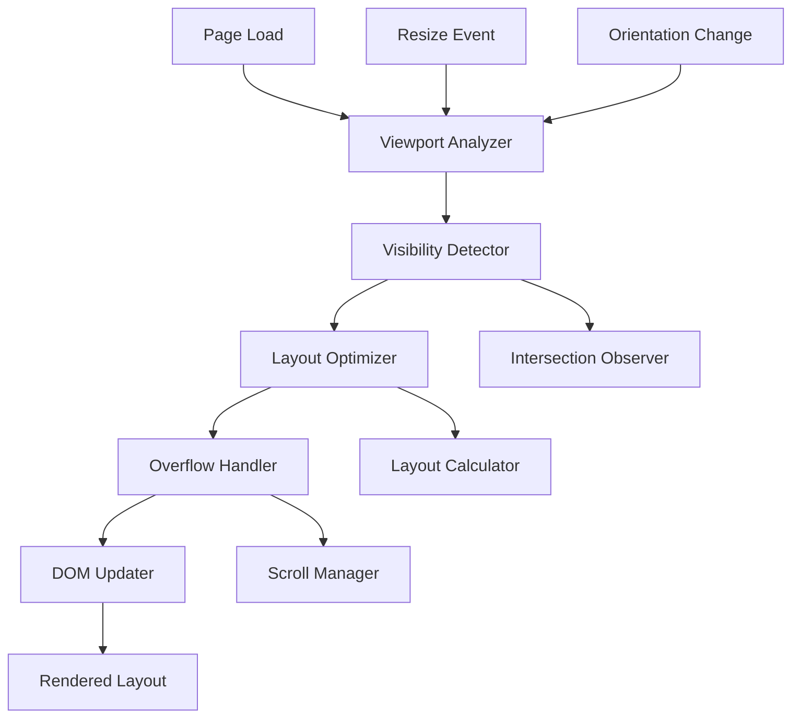
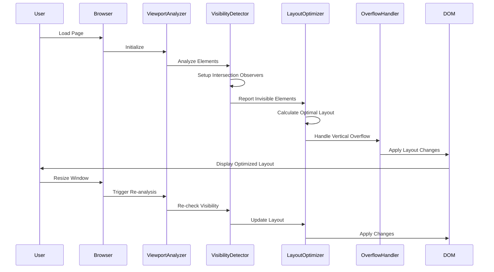

# Design Document: Adaptive Viewport Optimizer

## Overview

The Adaptive Viewport Optimizer is a client-side system that dynamically analyzes viewport dimensions and element visibility to automatically adjust UI layout. The system uses the Intersection Observer API to detect elements that overflow horizontally and repositions them vertically with scrolling support. The design prioritizes chess board visibility while ensuring all UI controls remain accessible across extreme screen size variations.

The system operates in three phases:
1. **Detection Phase**: Analyze viewport and identify invisible elements
2. **Optimization Phase**: Calculate optimal layout configuration
3. **Application Phase**: Apply layout changes with smooth transitions

## Architecture

### High-Level Architecture



### Component Interaction Flow



## Components and Interfaces

### 1. Viewport Analyzer

**Purpose**: Coordinates the overall viewport analysis and optimization process.

**Interface**:
```javascript
class ViewportAnalyzer {
  constructor(config) {
    // config: { debounceDelay: 150, minBoardSize: 280, spacing: 16 }
  }
  
  initialize() {
    // Set up event listeners and initial analysis
    // Returns: Promise<void>
  }
  
  analyzeViewport() {
    // Perform complete viewport analysis
    // Returns: ViewportAnalysisResult
  }
  
  handleResize() {
    // Debounced resize handler
    // Returns: void
  }
  
  handleOrientationChange() {
    // Handle device orientation changes
    // Returns: void
  }
  
  destroy() {
    // Clean up observers and event listeners
    // Returns: void
  }
}

interface ViewportAnalysisResult {
  viewportWidth: number;
  viewportHeight: number;
  availableSpace: { width: number; height: number };
  invisibleElements: Element[];
  boardDimensions: { width: number; height: number };
  layoutStrategy: 'horizontal' | 'vertical' | 'hybrid';
}
```

### 2. Visibility Detector

**Purpose**: Detects which UI elements are visible within the viewport using Intersection Observer API.

**Interface**:
```javascript
class VisibilityDetector {
  constructor(elements, options) {
    // elements: Array<Element> - UI elements to monitor
    // options: { threshold: 0.1, rootMargin: '0px' }
  }
  
  observe(element) {
    // Start observing an element
    // Returns: void
  }
  
  unobserve(element) {
    // Stop observing an element
    // Returns: void
  }
  
  getVisibilityMap() {
    // Get current visibility status of all elements
    // Returns: Map<Element, VisibilityStatus>
  }
  
  getInvisibleElements() {
    // Get list of currently invisible elements
    // Returns: Element[]
  }
  
  onVisibilityChange(callback) {
    // Register callback for visibility changes
    // callback: (element: Element, isVisible: boolean) => void
    // Returns: void
  }
  
  destroy() {
    // Disconnect all observers
    // Returns: void
  }
}

interface VisibilityStatus {
  isVisible: boolean;
  intersectionRatio: number;
  boundingRect: DOMRect;
  reason: 'in-viewport' | 'horizontal-overflow' | 'vertical-overflow' | 'hidden';
}
```

### 3. Layout Optimizer

**Purpose**: Calculates optimal layout configuration based on viewport dimensions and element visibility.

**Interface**:
```javascript
class LayoutOptimizer {
  constructor(config) {
    // config: { minBoardSize: 280, spacing: 16, prioritizeBoard: true }
  }
  
  calculateOptimalLayout(analysisResult) {
    // Calculate best layout configuration
    // analysisResult: ViewportAnalysisResult
    // Returns: LayoutConfiguration
  }
  
  calculateBoardSize(availableSpace, uiElements) {
    // Calculate maximum board size while accommodating UI
    // Returns: { width: number; height: number }
  }
  
  determineLayoutStrategy(viewportDimensions, elementCount) {
    // Determine if horizontal, vertical, or hybrid layout is best
    // Returns: 'horizontal' | 'vertical' | 'hybrid'
  }
  
  calculateElementPositions(elements, strategy, availableSpace) {
    // Calculate positions for all UI elements
    // Returns: Map<Element, Position>
  }
  
  validateLayout(configuration) {
    // Validate that calculated layout is valid
    // Returns: { valid: boolean; errors: string[] }
  }
}

interface LayoutConfiguration {
  boardSize: { width: number; height: number };
  boardPosition: Position;
  elementPositions: Map<Element, Position>;
  layoutStrategy: 'horizontal' | 'vertical' | 'hybrid';
  requiresScrolling: boolean;
  scrollContainers: ScrollContainerConfig[];
}

interface Position {
  x: number;
  y: number;
  width: number;
  height: number;
  transform: string;
  zIndex: number;
}

interface ScrollContainerConfig {
  elements: Element[];
  maxHeight: number;
  position: Position;
}
```

### 4. Overflow Handler

**Purpose**: Manages vertical repositioning and scrolling for overflowing elements.

**Interface**:
```javascript
class OverflowHandler {
  constructor(config) {
    // config: { smoothScroll: true, scrollIndicators: true }
  }
  
  createScrollContainer(elements, maxHeight) {
    // Create scrollable container for elements
    // Returns: HTMLElement
  }
  
  applyVerticalStacking(elements, containerWidth) {
    // Stack elements vertically within container
    // Returns: void
  }
  
  enableScrolling(container) {
    // Enable smooth scrolling with indicators
    // Returns: void
  }
  
  updateScrollIndicators(container) {
    // Update scroll position indicators
    // Returns: void
  }
  
  removeScrolling(container) {
    // Remove scrolling when no longer needed
    // Returns: void
  }
  
  handleTouchScroll(event) {
    // Handle touch-based scrolling
    // Returns: void
  }
}
```

### 5. DOM Updater

**Purpose**: Applies layout changes to the DOM with smooth transitions.

**Interface**:
```javascript
class DOMUpdater {
  constructor(config) {
    // config: { transitionDuration: 300, useTransforms: true }
  }
  
  applyLayout(configuration) {
    // Apply layout configuration to DOM
    // configuration: LayoutConfiguration
    // Returns: Promise<void>
  }
  
  updateElementPosition(element, position) {
    // Update single element position with transition
    // Returns: Promise<void>
  }
  
  batchUpdate(updates) {
    // Apply multiple updates in single animation frame
    // updates: Array<{ element: Element; position: Position }>
    // Returns: Promise<void>
  }
  
  revertToDefault(elements) {
    // Revert elements to original positions
    // Returns: Promise<void>
  }
}
```

### 6. Layout State Manager

**Purpose**: Manages layout state and caching for performance.

**Interface**:
```javascript
class LayoutStateManager {
  constructor() {
    // Initialize state storage
  }
  
  saveState(state) {
    // Save current layout state
    // state: LayoutState
    // Returns: void
  }
  
  getState() {
    // Get current layout state
    // Returns: LayoutState | null
  }
  
  getPreviousState() {
    // Get previous valid layout state
    // Returns: LayoutState | null
  }
  
  cacheElementDimensions(element) {
    // Cache element dimensions to reduce DOM queries
    // Returns: DOMRect
  }
  
  getCachedDimensions(element) {
    // Get cached dimensions
    // Returns: DOMRect | null
  }
  
  invalidateCache() {
    // Clear dimension cache
    // Returns: void
  }
}

interface LayoutState {
  timestamp: number;
  viewportDimensions: { width: number; height: number };
  configuration: LayoutConfiguration;
  elementDimensions: Map<Element, DOMRect>;
  isValid: boolean;
}
```

## Data Models

### Viewport Dimensions
```javascript
interface ViewportDimensions {
  width: number;           // Viewport width in pixels
  height: number;          // Viewport height in pixels
  aspectRatio: number;     // width / height
  orientation: 'portrait' | 'landscape';
  devicePixelRatio: number;
}
```

### Element Metadata
```javascript
interface ElementMetadata {
  element: Element;
  id: string;
  type: 'control' | 'info' | 'board' | 'menu';
  priority: number;        // Higher priority = more important
  minWidth: number;
  minHeight: number;
  canStack: boolean;       // Can be stacked vertically
  canScroll: boolean;      // Can be placed in scroll container
  originalPosition: Position;
  currentPosition: Position;
}
```

### Layout Constraints
```javascript
interface LayoutConstraints {
  minBoardSize: { width: number; height: number };
  maxBoardSize: { width: number; height: number };
  minSpacing: number;
  maxElementsPerRow: number;
  preserveAspectRatio: boolean;
  prioritizeBoard: boolean;
}
```

### Adaptive Breakpoint
```javascript
interface AdaptiveBreakpoint {
  threshold: number;       // Width at which layout changes
  reason: string;          // Why this breakpoint exists
  layoutStrategy: 'horizontal' | 'vertical' | 'hybrid';
  affectedElements: Element[];
  calculatedAt: number;    // Timestamp
}
```

## Correctness Properties

*A property is a characteristic or behavior that should hold true across all valid executions of a system—essentially, a formal statement about what the system should do. Properties serve as the bridge between human-readable specifications and machine-verifiable correctness guarantees.*


### Property Reflection

After analyzing all acceptance criteria, I identified several areas of redundancy:

**Redundancy Group 1 - Visibility Detection**:
- Properties 1.1 and 1.2 both test visibility detection but can be combined into one comprehensive property about correct visibility classification

**Redundancy Group 2 - Performance Timing**:
- Properties 1.3, 4.3, 5.5, and 8.1 all test timing constraints but can be consolidated into a general performance property

**Redundancy Group 3 - Feature Preservation**:
- Properties 9.1, 9.2, 9.3, and 9.4 all test that features are preserved and can be combined into one comprehensive preservation property

**Redundancy Group 4 - Board Priority**:
- Properties 6.4, 7.1, 7.2, and 7.4 all relate to board priority and can be consolidated

**Redundancy Group 5 - Viewport Range Support**:
- Properties 5.1 and 5.2 test width and height ranges separately but can be combined into one property

**Consolidated Properties**:
After reflection, I've consolidated 40+ testable criteria into 25 unique, non-redundant properties that provide comprehensive coverage without duplication.

### Correctness Properties

**Property 1: Visibility Classification Accuracy**
*For any* UI element and viewport configuration, the Visibility_Detector should correctly classify the element as visible if any part of it intersects the viewport, and invisible otherwise.
**Validates: Requirements 1.1, 1.2**

**Property 2: Visibility Re-analysis on Resize**
*For any* viewport resize event, the Visibility_Detector should re-analyze all elements and update their visibility status within the configured time threshold.
**Validates: Requirements 1.3**

**Property 3: In-Memory Analysis Only**
*For any* viewport analysis operation, no files should be created on disk and no persistent storage should be used.
**Validates: Requirements 1.5**

**Property 4: Horizontal Overflow Triggers Vertical Repositioning**
*For any* UI element that is invisible due to horizontal overflow, the Layout_Optimizer should reposition it to a vertical layout where it becomes visible.
**Validates: Requirements 2.1**

**Property 5: Element Grouping Preservation**
*For any* set of logically grouped UI elements, after repositioning, the elements should remain adjacent to each other in the new layout.
**Validates: Requirements 2.2**

**Property 6: Event Handler Preservation**
*For any* UI element with attached event handlers, after repositioning, all event handlers should remain functional and fire correctly.
**Validates: Requirements 2.3, 9.1**

**Property 7: Layout Restoration Round-Trip**
*For any* viewport configuration, if the viewport is shrunk to trigger vertical repositioning and then expanded back to the original size, elements should return to their original horizontal positions.
**Validates: Requirements 2.5**

**Property 8: Vertical Overflow Creates Scroll Container**
*For any* set of vertically stacked elements whose total height exceeds the viewport height, a scrollable container should be created to contain them.
**Validates: Requirements 3.1**

**Property 9: Scroll Indicators Presence**
*For any* scrollable container with content that exceeds its visible area, visual scroll indicators should be present and visible.
**Validates: Requirements 3.3**

**Property 10: Board Visibility Invariant During Scrolling**
*For any* scroll operation on UI elements, the chess board should remain fully visible within the viewport throughout the scroll.
**Validates: Requirements 3.4**

**Property 11: Scroll Removal When Unnecessary**
*For any* scrollable container, if the viewport height increases such that all content fits naturally, the scroll container should be removed or disabled.
**Validates: Requirements 3.5**

**Property 12: Analysis Before Rendering**
*For any* page load, viewport analysis should complete and layout configuration should be calculated before UI elements are rendered to the DOM.
**Validates: Requirements 4.1**

**Property 13: Applied Layout Matches Calculated Layout**
*For any* calculated layout configuration, the actual DOM element positions should match the calculated positions within a tolerance of 1px.
**Validates: Requirements 4.2**

**Property 14: Performance Timing Constraints**
*For any* layout operation (initial load, resize, orientation change), the operation should complete within its specified time threshold (100-200ms).
**Validates: Requirements 1.3, 4.3, 5.5, 8.1**

**Property 15: Re-analysis After Content Load**
*For any* page load where images or fonts are still loading, a re-analysis should be triggered after the load event completes.
**Validates: Requirements 4.4**

**Property 16: Layout Shift Prevention**
*For any* initial page load, the cumulative layout shift (CLS) score should be less than 0.1, indicating minimal visual instability.
**Validates: Requirements 4.5**

**Property 17: Extreme Viewport Dimension Support**
*For any* viewport width between 320px and 3840px and height between 480px and 2160px, the layout optimizer should produce a valid layout configuration.
**Validates: Requirements 5.1, 5.2**

**Property 18: Orientation Handling**
*For any* device orientation (portrait or landscape), the layout optimizer should produce an appropriate layout configuration.
**Validates: Requirements 5.4**

**Property 19: Content-Aware Breakpoints**
*For any* layout configuration, adaptive breakpoints should be calculated based on actual element dimensions and visibility, not fixed pixel values.
**Validates: Requirements 6.1**

**Property 20: Visibility-Triggered Recalculation**
*For any* element that transitions from visible to invisible (or vice versa), a layout recalculation should be triggered regardless of viewport size.
**Validates: Requirements 6.2**

**Property 21: Minimum Spacing Invariant**
*For any* layout configuration, the spacing between any two adjacent UI elements should be at least 16px.
**Validates: Requirements 6.3**

**Property 22: Board Size Maximization**
*For any* set of possible layout configurations, the chosen configuration should be the one that maximizes chess board size while satisfying all constraints.
**Validates: Requirements 6.5, 7.5**

**Property 23: Board Visibility and Minimum Size Invariant**
*For any* layout configuration, the chess board should be fully visible within the viewport and have dimensions of at least 280px × 280px.
**Validates: Requirements 7.1, 7.3**

**Property 24: Board Priority Over UI Elements**
*For any* layout calculation where UI elements conflict with board space, the board size should be preserved at its optimal size and UI elements should be repositioned.
**Validates: Requirements 6.4, 7.2, 7.4**

**Property 25: Resize Event Debouncing**
*For any* rapid sequence of resize events (more than 10 events within 100ms), the number of layout recalculations should be significantly less than the number of events (at most 1-2 recalculations).
**Validates: Requirements 8.3**

**Property 26: DOM Query Caching**
*For any* layout recalculation, the number of DOM queries for element dimensions should be minimized through caching, with cache hits exceeding 80% after the first calculation.
**Validates: Requirements 8.4**

**Property 27: Animation Queuing**
*For any* layout request that arrives while an animation is in progress, the request should be queued and executed after the animation completes, not interrupt it.
**Validates: Requirements 8.5**

**Property 28: Accessibility Feature Preservation**
*For any* UI element with ARIA attributes, keyboard navigation handlers, or other accessibility features, these features should remain functional after repositioning.
**Validates: Requirements 9.2, 9.3**

**Property 29: Theme Styling Preservation**
*For any* UI element with theme-specific styling, the computed styles should match the expected theme colors and properties after repositioning.
**Validates: Requirements 9.4**

**Property 30: Position Validation Before Application**
*For any* calculated layout configuration, all positions should be validated (non-negative coordinates, within viewport bounds) before being applied to the DOM.
**Validates: Requirements 10.4**

**Property 31: Error Logging and Continuation**
*For any* error that occurs during layout optimization, the error should be logged and the system should continue with partial optimization rather than failing completely.
**Validates: Requirements 10.3**

## Error Handling

### Error Categories

1. **API Unavailability Errors**
   - Intersection Observer not supported
   - requestAnimationFrame not available
   - Fallback: Use viewport dimension calculations and setTimeout

2. **Calculation Errors**
   - Invalid dimensions (negative, NaN, Infinity)
   - Unsolvable layout constraints
   - Fallback: Apply safe default layout

3. **DOM Manipulation Errors**
   - Element not found
   - Style application fails
   - Fallback: Skip element and continue with others

4. **Performance Errors**
   - Calculation timeout
   - Excessive recalculation requests
   - Fallback: Use cached layout or default

### Error Handling Strategy

```javascript
class ErrorHandler {
  handleError(error, context) {
    // Log error with context
    console.error(`[ViewportOptimizer] ${context}:`, error);
    
    // Determine fallback strategy
    switch (error.type) {
      case 'API_UNAVAILABLE':
        return this.applyPolyfill(error);
      case 'CALCULATION_ERROR':
        return this.applyDefaultLayout();
      case 'DOM_ERROR':
        return this.skipElement(error.element);
      case 'PERFORMANCE_ERROR':
        return this.useCachedLayout();
      default:
        return this.applyDefaultLayout();
    }
  }
  
  applyDefaultLayout() {
    // Safe default: horizontal layout with standard breakpoints
    return {
      layoutStrategy: 'horizontal',
      boardSize: { width: 400, height: 400 },
      useStandardBreakpoints: true
    };
  }
}
```

### Validation Rules

All calculated positions must satisfy:
- `x >= 0 && y >= 0`
- `width > 0 && height > 0`
- `x + width <= viewport.width`
- `y + height <= viewport.height`
- `!isNaN(x) && !isNaN(y) && !isNaN(width) && !isNaN(height)`
- `isFinite(x) && isFinite(y) && isFinite(width) && isFinite(height)`

## Testing Strategy

### Dual Testing Approach

This feature requires both unit tests and property-based tests for comprehensive coverage:

**Unit Tests** focus on:
- Specific examples of viewport configurations (320×480, 1920×1080, 3840×2160)
- Edge cases like extreme aspect ratios
- Error conditions and fallback behavior
- Integration with existing features
- Browser API availability checks

**Property-Based Tests** focus on:
- Universal properties across all viewport dimensions
- Layout correctness across random configurations
- Performance characteristics across varied inputs
- Invariants that must hold in all cases
- Round-trip properties for layout restoration

### Property-Based Testing Configuration

**Testing Library**: Use `fast-check` for JavaScript property-based testing

**Test Configuration**:
- Minimum 100 iterations per property test
- Each test tagged with: `Feature: adaptive-viewport-optimizer, Property {N}: {property_text}`
- Custom generators for viewport dimensions, element configurations, and layout states

**Example Property Test Structure**:
```javascript
// Feature: adaptive-viewport-optimizer, Property 1: Visibility Classification Accuracy
fc.assert(
  fc.property(
    fc.record({
      viewportWidth: fc.integer({ min: 320, max: 3840 }),
      viewportHeight: fc.integer({ min: 480, max: 2160 }),
      elementX: fc.integer({ min: -500, max: 4000 }),
      elementY: fc.integer({ min: -500, max: 2500 }),
      elementWidth: fc.integer({ min: 50, max: 500 }),
      elementHeight: fc.integer({ min: 50, max: 500 })
    }),
    (config) => {
      const detector = new VisibilityDetector(/* ... */);
      const isVisible = detector.checkVisibility(config);
      
      // Element is visible if it intersects viewport
      const intersects = 
        config.elementX < config.viewportWidth &&
        config.elementX + config.elementWidth > 0 &&
        config.elementY < config.viewportHeight &&
        config.elementY + config.elementHeight > 0;
      
      return isVisible === intersects;
    }
  ),
  { numRuns: 100 }
);
```

### Test Coverage Requirements

- All 31 correctness properties must have corresponding property-based tests
- Each property test must run minimum 100 iterations
- Unit tests should cover at least 5 specific viewport configurations
- Integration tests should verify compatibility with existing features
- Performance tests should measure timing constraints

### Testing Phases

1. **Unit Testing Phase**: Test individual components with specific examples
2. **Property Testing Phase**: Verify universal properties across random inputs
3. **Integration Testing Phase**: Test interaction with existing chess application features
4. **Performance Testing Phase**: Verify timing constraints and optimization effectiveness
5. **Cross-Browser Testing Phase**: Verify behavior across different browsers and devices

## Implementation Notes

### Browser Compatibility

- **Intersection Observer**: Supported in all modern browsers, polyfill available for older browsers
- **CSS Grid/Flexbox**: Widely supported, fallback to absolute positioning if needed
- **requestAnimationFrame**: Universal support, setTimeout fallback available
- **ResizeObserver**: Good support, fallback to window resize events

### Performance Optimizations

1. **Debouncing**: Resize events debounced to 150ms
2. **Caching**: Element dimensions cached to reduce DOM queries
3. **RAF Batching**: All DOM updates batched in single animation frame
4. **Lazy Calculation**: Only recalculate when visibility actually changes
5. **Early Exit**: Skip recalculation if viewport change is minimal (<10px)

### Integration Points

The system integrates with existing features:
- **Theme System**: Preserves theme classes and styles during repositioning
- **Settings Menu**: Ensures menu remains accessible in all layouts
- **Piece Setup**: Maintains piece setup controls visibility
- **Analysis Controls**: Keeps analysis buttons accessible
- **Move History**: Ensures move history scrolling works with layout scrolling
- **Position Sharing**: Preserves sharing functionality in all layouts

### CSS Architecture

```css
/* Adaptive layout container */
.adaptive-layout-container {
  display: grid;
  grid-template-areas: "board" "controls";
  gap: var(--spacing, 16px);
  transition: all 300ms ease-in-out;
}

/* Horizontal layout (default) */
@media (min-width: 768px) {
  .adaptive-layout-container {
    grid-template-areas: "controls board";
    grid-template-columns: auto 1fr;
  }
}

/* Vertical layout (small screens) */
.adaptive-layout-container.vertical {
  grid-template-areas: "board" "controls";
  grid-template-columns: 1fr;
}

/* Scroll container for overflowing elements */
.adaptive-scroll-container {
  max-height: calc(100vh - var(--board-height) - 32px);
  overflow-y: auto;
  overflow-x: hidden;
  scroll-behavior: smooth;
}

/* Scroll indicators */
.scroll-indicator {
  position: sticky;
  height: 4px;
  background: linear-gradient(to right, transparent, var(--accent-color), transparent);
  opacity: 0;
  transition: opacity 200ms;
}

.scroll-indicator.visible {
  opacity: 1;
}
```

### JavaScript Architecture

```javascript
// Main initialization
class AdaptiveViewportSystem {
  constructor() {
    this.analyzer = new ViewportAnalyzer({
      debounceDelay: 150,
      minBoardSize: 280,
      spacing: 16
    });
    
    this.detector = new VisibilityDetector(
      this.getUIElements(),
      { threshold: 0.1 }
    );
    
    this.optimizer = new LayoutOptimizer({
      minBoardSize: 280,
      spacing: 16,
      prioritizeBoard: true
    });
    
    this.overflowHandler = new OverflowHandler({
      smoothScroll: true,
      scrollIndicators: true
    });
    
    this.domUpdater = new DOMUpdater({
      transitionDuration: 300,
      useTransforms: true
    });
    
    this.stateManager = new LayoutStateManager();
    this.errorHandler = new ErrorHandler();
  }
  
  async initialize() {
    try {
      // Perform initial analysis
      const analysis = await this.analyzer.analyzeViewport();
      
      // Calculate optimal layout
      const layout = this.optimizer.calculateOptimalLayout(analysis);
      
      // Validate layout
      const validation = this.optimizer.validateLayout(layout);
      if (!validation.valid) {
        throw new Error(`Invalid layout: ${validation.errors.join(', ')}`);
      }
      
      // Apply layout
      await this.domUpdater.applyLayout(layout);
      
      // Save state
      this.stateManager.saveState({
        timestamp: Date.now(),
        viewportDimensions: {
          width: analysis.viewportWidth,
          height: analysis.viewportHeight
        },
        configuration: layout,
        isValid: true
      });
      
      // Set up event listeners
      this.setupEventListeners();
      
    } catch (error) {
      this.errorHandler.handleError(error, 'initialization');
    }
  }
  
  setupEventListeners() {
    window.addEventListener('resize', 
      this.analyzer.handleResize.bind(this.analyzer)
    );
    
    window.addEventListener('orientationchange',
      this.analyzer.handleOrientationChange.bind(this.analyzer)
    );
    
    this.detector.onVisibilityChange((element, isVisible) => {
      if (!isVisible) {
        this.handleInvisibleElement(element);
      }
    });
  }
  
  async handleInvisibleElement(element) {
    try {
      const analysis = await this.analyzer.analyzeViewport();
      const layout = this.optimizer.calculateOptimalLayout(analysis);
      await this.domUpdater.applyLayout(layout);
    } catch (error) {
      this.errorHandler.handleError(error, 'handleInvisibleElement');
    }
  }
  
  getUIElements() {
    return [
      document.querySelector('.controls-left'),
      document.querySelector('.controls-right'),
      document.querySelector('.move-history'),
      document.querySelector('.analysis-panel'),
      document.querySelector('.settings-menu')
    ].filter(Boolean);
  }
}

// Initialize on page load
document.addEventListener('DOMContentLoaded', () => {
  const system = new AdaptiveViewportSystem();
  system.initialize();
});
```

## Future Enhancements

1. **Machine Learning**: Learn user preferences for layout configurations
2. **Gesture Support**: Swipe gestures to manually adjust layout
3. **Layout Presets**: Save and load custom layout configurations
4. **Multi-Monitor**: Detect and optimize for multi-monitor setups
5. **Accessibility Modes**: Special layouts for screen readers and assistive technologies
6. **Performance Profiling**: Built-in performance monitoring and optimization suggestions
