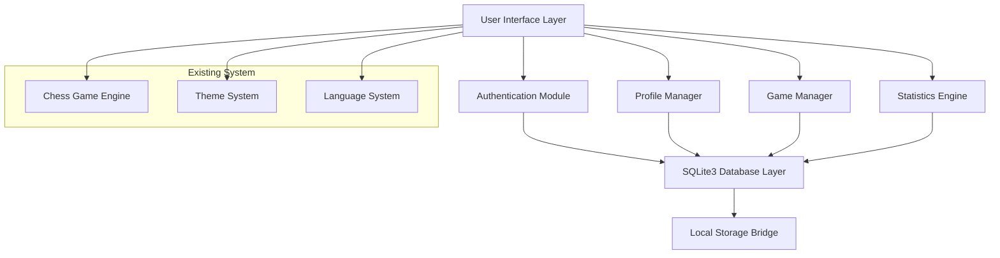
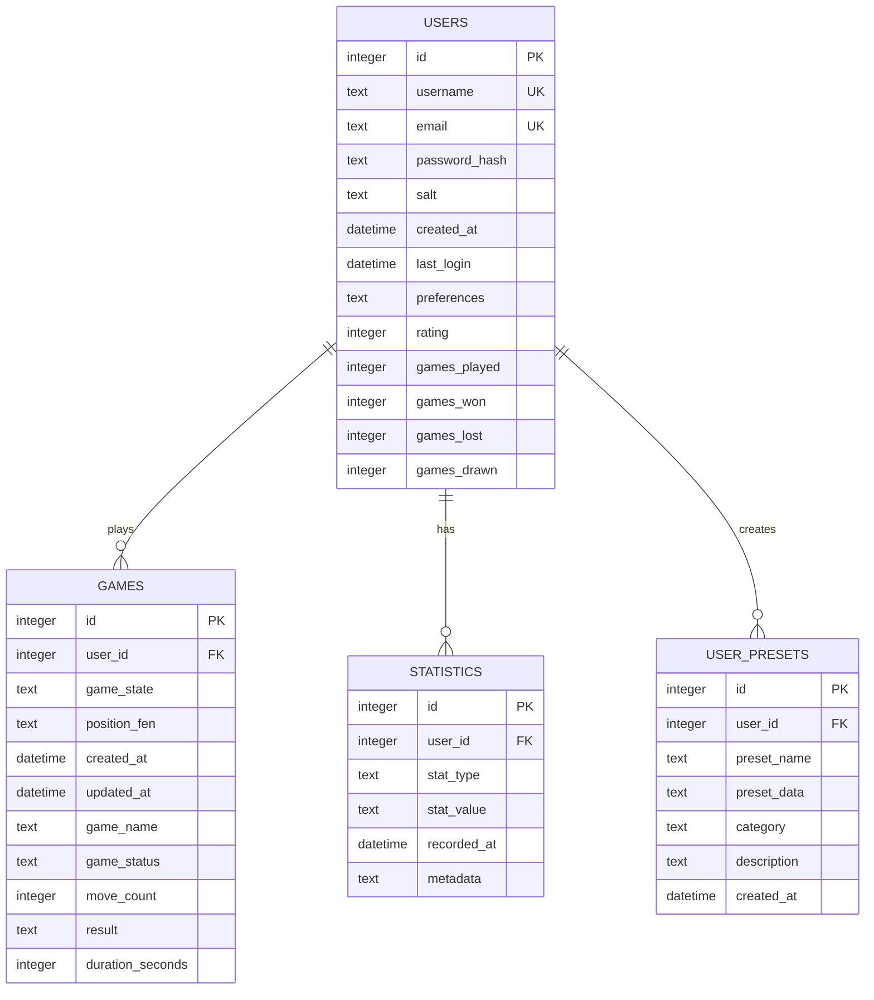

# Design Document

## Overview

Bu tasarım dokümanı, mevcut HTML/CSS/JavaScript tabanlı Türkçe satranç uygulaması için kapsamlı bir kullanıcı sistemi ve oyun yönetimi özelliğinin teknik tasarımını tanımlar. Sistem, client-side SQLite3 entegrasyonu ile kullanıcı kimlik doğrulama, profil yönetimi, oyun kaydetme/yükleme ve istatistik takibi sağlayacaktır.

Mevcut uygulama localStorage tabanlı veri saklama kullanmaktadır. Bu tasarım, mevcut sistemi SQLite3 tabanlı bir yapıya geçirecek ve kapsamlı kullanıcı yönetimi ekleyecektir.

## Architecture

### High-Level Architecture



### Database Architecture



## Components and Interfaces

### 1. Authentication Module (AuthManager)

**Sorumluluklar:**
- Kullanıcı kaydı ve giriş işlemleri
- Şifre hash'leme ve doğrulama
- Oturum yönetimi
- Güvenlik kontrolleri

**Ana Metodlar:**
```javascript
class AuthManager {
    async register(username, email, password)
    async login(username, password)
    async logout()
    async changePassword(oldPassword, newPassword)
    isLoggedIn()
    getCurrentUser()
    validatePassword(password)
    hashPassword(password, salt)
}
```

### 2. Profile Manager (ProfileManager)

**Sorumluluklar:**
- Kullanıcı profil bilgileri yönetimi
- Kişisel ayarlar (board tasarımları, tercihler)
- Profil güncelleme işlemleri

**Ana Metodlar:**
```javascript
class ProfileManager {
    async getProfile(userId)
    async updateProfile(userId, profileData)
    async getBoardPreferences(userId)
    async saveBoardPreferences(userId, preferences)
    async getGameSettings(userId)
    async updateGameSettings(userId, settings)
}
```

### 3. Game Manager (GameManager)

**Sorumluluklar:**
- Oyun durumu kaydetme ve yükleme
- Oyun geçmişi yönetimi
- Oyun metadata'sı saklama

**Ana Metodlar:**
```javascript
class GameManager {
    async saveGame(userId, gameState, gameName)
    async loadGame(userId, gameId)
    async deleteGame(userId, gameId)
    async listUserGames(userId, limit, offset)
    async updateGameState(gameId, gameState)
    async completeGame(gameId, result, duration)
}
```

### 4. Statistics Engine (StatsEngine)

**Sorumluluklar:**
- Oyun istatistikleri hesaplama
- Rating sistemi yönetimi
- Performans analizi
- Başarı takibi

**Ana Metodlar:**
```javascript
class StatsEngine {
    async recordGameResult(userId, result, duration, moveCount)
    async calculateRating(userId, opponentRating, result)
    async getPlayerStats(userId)
    async getPerformanceHistory(userId, period)
    async updateAchievements(userId)
    async getLeaderboard(limit)
}
```

### 5. Database Layer (DatabaseManager)

**Sorumluluklar:**
- SQLite3 veritabanı bağlantı yönetimi
- SQL sorgu çalıştırma
- Transaction yönetimi
- Veri bütünlüğü kontrolü

**Ana Metodlar:**
```javascript
class DatabaseManager {
    async initialize()
    async executeQuery(sql, params)
    async beginTransaction()
    async commitTransaction()
    async rollbackTransaction()
    async backup()
    async restore(backupData)
}
```

### 6. UI Integration Layer (UserSystemUI)

**Sorumluluklar:**
- Mevcut arayüz ile entegrasyon
- Kullanıcı sistemi modal'ları
- Dinamik menü güncelleme
- Responsive tasarım

**Ana Metodlar:**
```javascript
class UserSystemUI {
    showLoginModal()
    showRegisterModal()
    showProfileModal()
    showGameHistoryModal()
    updateUserMenu(user)
    showNotification(message, type)
    updateGameStats(stats)
}
```

## Data Models

### User Model
```javascript
const UserModel = {
    id: Number,
    username: String,
    email: String,
    passwordHash: String,
    salt: String,
    createdAt: Date,
    lastLogin: Date,
    preferences: {
        language: String,
        theme: String,
        boardStyle: String,
        soundEnabled: Boolean,
        autoSave: Boolean
    },
    rating: Number,
    gamesPlayed: Number,
    gamesWon: Number,
    gamesLost: Number,
    gamesDrawn: Number
}
```

### Game Model
```javascript
const GameModel = {
    id: Number,
    userId: Number,
    gameState: {
        board: Array,
        currentPlayer: String,
        moveHistory: Array,
        capturedPieces: Object,
        gameSettings: Object
    },
    positionFen: String,
    createdAt: Date,
    updatedAt: Date,
    gameName: String,
    gameStatus: String, // 'active', 'completed', 'paused'
    moveCount: Number,
    result: String, // 'white_wins', 'black_wins', 'draw', null
    durationSeconds: Number
}
```

### Statistics Model
```javascript
const StatisticsModel = {
    id: Number,
    userId: Number,
    statType: String, // 'game_result', 'rating_change', 'achievement'
    statValue: String,
    recordedAt: Date,
    metadata: Object
}
```

### User Preset Model
```javascript
const UserPresetModel = {
    id: Number,
    userId: Number,
    presetName: String,
    presetData: {
        board: Array,
        description: String,
        difficulty: String
    },
    category: String,
    description: String,
    createdAt: Date
}
```

## Correctness Properties

*A property is a characteristic or behavior that should hold true across all valid executions of a system-essentially, a formal statement about what the system should do. Properties serve as the bridge between human-readable specifications and machine-verifiable correctness guarantees.*

### Authentication Properties

**Property 1: User Registration Consistency**
*For any* valid user registration data (username, email, password), the registration process should create a new user record in the database with properly hashed password and unique identifiers
**Validates: Requirements 1.1**

**Property 2: Valid Login Authentication**
*For any* registered user with correct credentials, the authentication system should successfully validate the user and establish an active session
**Validates: Requirements 1.2**

**Property 3: Invalid Login Rejection**
*For any* login attempt with incorrect credentials, the authentication system should reject the login and return an appropriate error message
**Validates: Requirements 1.3**

**Property 4: Session Cleanup on Logout**
*For any* active user session, logging out should completely clear all session data and user state
**Validates: Requirements 1.4**

**Property 5: Password Security**
*For any* password, the system should hash it using a secure algorithm such that the same password produces different hashes and the original password cannot be recovered from the hash
**Validates: Requirements 1.5**

### Profile Management Properties

**Property 6: Profile Data Retrieval**
*For any* authenticated user, accessing their profile should return all current profile information accurately
**Validates: Requirements 2.1**

**Property 7: Profile Update Persistence**
*For any* profile update operation, the changes should be permanently saved to the database and reflected in subsequent profile retrievals
**Validates: Requirements 2.2**

**Property 8: Statistics Calculation Accuracy**
*For any* user with game history, the displayed statistics (total games, win/loss ratio, average game duration) should accurately reflect the actual game data
**Validates: Requirements 2.3**

**Property 9: Board Preference Persistence**
*For any* board design preference selection, the preference should be saved and automatically applied in future games
**Validates: Requirements 2.4**

**Property 10: Multi-Score Tracking**
*For any* user, different score types (rating, achievement points) should be tracked independently and accurately
**Validates: Requirements 2.5**

### Game Management Properties

**Property 11: Game Save-Load Round Trip**
*For any* game state, saving the game and then loading it should restore the exact same game state with all pieces, moves, and metadata intact
**Validates: Requirements 3.1, 3.3**

**Property 12: Game List Chronological Ordering**
*For any* user's saved games, the game list should display all games in chronological order (newest first) with complete metadata
**Validates: Requirements 3.2**

**Property 13: Game Metadata Completeness**
*For any* saved game, all required metadata (date, duration, game status) should be stored and retrievable
**Validates: Requirements 3.4**

**Property 14: Game Deletion Completeness**
*For any* game deletion operation, the game should be permanently removed from the database and no longer accessible through any query
**Validates: Requirements 3.5**

### Statistics Properties

**Property 15: Game Result Recording**
*For any* completed game, the result and all relevant details should be recorded in the statistics system
**Validates: Requirements 4.1**

**Property 16: Game Count Accuracy**
*For any* user, the total counts of games played, won, lost, and drawn should accurately reflect all recorded game results
**Validates: Requirements 4.2**

**Property 17: Rating Update Consistency**
*For any* game result, the user's rating should be updated according to the rating algorithm and the change should be persistent
**Validates: Requirements 4.3**

**Property 18: Statistics Display Completeness**
*For any* user accessing their statistics, all performance data should be displayed in both graphical and numerical formats
**Validates: Requirements 4.4**

**Property 19: Streak Tracking Accuracy**
*For any* sequence of game results, the system should accurately track and display the longest winning streak and best performance periods
**Validates: Requirements 4.5**

### Database Properties

**Property 20: SQLite3 Format Compliance**
*For any* data stored in the system, it should be in valid SQLite3 format and readable by standard SQLite3 tools
**Validates: Requirements 5.1**

**Property 21: Database Initialization Completeness**
*For any* application startup, all required database tables should exist and be properly structured after initialization
**Validates: Requirements 5.2**

**Property 22: Transaction Atomicity**
*For any* database operation, it should be executed within a transaction such that either all changes succeed or all changes are rolled back
**Validates: Requirements 5.3**

**Property 23: Error Handling and Logging**
*For any* database error condition, the error should be logged and an appropriate user message should be displayed
**Validates: Requirements 5.4**

**Property 24: Data Integrity Validation**
*For any* data integrity check, corrupted or invalid records should be detected and reported
**Validates: Requirements 5.5**

### Security Properties

**Property 25: Password Hashing Security**
*For any* user password, it should be hashed using bcrypt or equivalent secure algorithm with proper salt
**Validates: Requirements 6.1**

**Property 26: Sensitive Data Encryption**
*For any* sensitive data stored in the database, it should be encrypted and not readable in plain text
**Validates: Requirements 6.2**

**Property 27: Data Export-Import Round Trip**
*For any* user data export operation, importing the exported data should restore the exact same user state and data
**Validates: Requirements 6.3, 6.4**

**Property 28: Automatic Backup Reliability**
*For any* configured backup interval, the system should create backups automatically and the backups should be valid and restorable
**Validates: Requirements 6.5**

### UI Integration Properties

**Property 29: Turkish Interface Compatibility**
*For any* user system component, it should integrate seamlessly with the existing Turkish interface and maintain consistent styling
**Validates: Requirements 7.1**

**Property 30: Authentication State UI Consistency**
*For any* authentication state (logged in/out), the UI should display appropriate menu options and user information
**Validates: Requirements 7.2, 7.3**

**Property 31: Theme System Compatibility**
*For any* theme change, all user system components should adapt to the new theme consistently
**Validates: Requirements 7.4**

**Property 32: Responsive Design Functionality**
*For any* screen size or device type, the user system interface should remain functional and properly formatted
**Validates: Requirements 7.5**

### Performance Properties

**Property 33: Query Response Time**
*For any* database query, even with large datasets, the response time should be under 100ms
**Validates: Requirements 8.1**

**Property 34: Lazy Loading Efficiency**
*For any* data loading operation, only the required data should be loaded, not the entire dataset
**Validates: Requirements 8.2**

**Property 35: Pagination Functionality**
*For any* large dataset display, data should be presented in paginated format with proper navigation
**Validates: Requirements 8.3**

**Property 36: Asynchronous Statistics Processing**
*For any* statistics calculation, it should be performed in the background without blocking the user interface
**Validates: Requirements 8.4**

**Property 37: Query Optimization**
*For any* frequently used database query, it should be optimized with proper indexing for faster execution
**Validates: Requirements 8.5**

## Error Handling

### Authentication Errors
- **Invalid Credentials**: Clear error messages for wrong username/password
- **Duplicate Registration**: Prevent duplicate usernames/emails with informative messages
- **Session Timeout**: Graceful handling of expired sessions with re-authentication prompts
- **Password Strength**: Real-time validation of password requirements

### Database Errors
- **Connection Failures**: Retry mechanisms and offline mode capabilities
- **Constraint Violations**: User-friendly messages for data validation errors
- **Transaction Failures**: Automatic rollback and error recovery
- **Corruption Detection**: Data integrity checks and repair mechanisms

### Game Management Errors
- **Save Failures**: Retry mechanisms and temporary storage
- **Load Failures**: Graceful degradation and error recovery
- **Invalid Game States**: Validation and correction of corrupted game data
- **Storage Limits**: Warnings and cleanup for storage space management

### UI Integration Errors
- **Modal Failures**: Fallback UI components and error boundaries
- **Theme Conflicts**: Default theme fallback and error recovery
- **Responsive Breakpoints**: Graceful degradation on unsupported devices
- **Language Loading**: Fallback to default language on translation errors

## Testing Strategy

### Dual Testing Approach

The testing strategy employs both unit testing and property-based testing to ensure comprehensive coverage:

**Unit Tests**: Focus on specific examples, edge cases, and integration points
- Authentication flow examples (valid/invalid credentials)
- Database connection and initialization
- UI component rendering and interaction
- Error condition handling
- Edge cases for data validation

**Property-Based Tests**: Verify universal properties across all inputs
- Each correctness property will be implemented as a property-based test
- Minimum 100 iterations per property test for thorough validation
- Random data generation for comprehensive input coverage
- Tag format: **Feature: chess-user-system, Property {number}: {property_text}**

### Property-Based Testing Configuration

**Testing Library**: For JavaScript environment, we will use **fast-check** library for property-based testing
- Provides excellent random data generation capabilities
- Integrates well with existing JavaScript testing frameworks
- Supports complex data structure generation

**Test Configuration**:
- Each property test runs minimum 100 iterations
- Custom generators for chess-specific data (board states, user data, game states)
- Shrinking capabilities to find minimal failing examples
- Integration with existing test infrastructure

**Test Organization**:
- Property tests organized by component (Auth, Profile, Game, Stats, Database)
- Each test references its corresponding design document property
- Comprehensive logging and reporting for property test failures
- Continuous integration pipeline integration

### Integration Testing

**Database Integration**:
- SQLite3 database setup and teardown for each test suite
- Transaction testing with rollback scenarios
- Performance testing with large datasets
- Data migration and schema evolution testing

**UI Integration**:
- Modal and form interaction testing
- Theme switching and responsive design testing
- Language switching and localization testing
- Cross-browser compatibility testing

**End-to-End Workflows**:
- Complete user registration and login flows
- Game save/load/delete workflows
- Statistics calculation and display workflows
- Data export/import workflows