# Tasarım Belgesi

## Genel Bakış

Bu belge, 4x5 satranç oyununda mevcut "Piece Setup" özelliğinin geliştirilmesi için teknik tasarımı tanımlar. Mevcut sistem korunarak, kullanıcı deneyimi, görsel tasarım, analiz yetenekleri ve paylaşım özellikleri geliştirilecektir.

Mevcut sistem zaten temel drag & drop, palette seçimi, preset pozisyonlar ve pozisyon doğrulama özelliklerine sahiptir. Bu tasarım, bu temeller üzerine inşa edilerek daha gelişmiş özellikler ekleyecektir.

## Mimari

### Mevcut Sistem Analizi

Mevcut piece setup sistemi şu bileşenlerden oluşmaktadır:

- **Modal Arayüz**: `pieceSetupModal` - tam ekran modal
- **Piece Palette**: Taş seçim paneli (beyaz/siyah taşlar)
- **Setup Board**: 4x5 düzenleme tahtası
- **Temel Kontroller**: Temizle, varsayılan, rastgele, kaydet/yükle
- **Drag & Drop**: Temel sürükle-bırak işlevselliği
- **Pozisyon Doğrulama**: Kral kontrolü ve temel istatistikler

### Geliştirilmiş Mimari

```mermaid
graph TB
    A[Enhanced Piece Setup Modal] --> B[Modern UI Layer]
    A --> C[Enhanced Palette System]
    A --> D[Advanced Board Manager]
    A --> E[Position Analysis Engine]
    A --> F[Sharing System]
    A --> G[History Manager]
    A --> H[Mobile Optimization Layer]
    
    B --> B1[Responsive Design]
    B --> B2[Visual Feedback]
    B --> B3[Animations]
    
    C --> C1[Extended Presets]
    C --> C2[Smart Piece Selection]
    C --> C3[Visual Indicators]
    
    D --> D1[Enhanced Validation]
    D --> D2[Position Utilities]
    D --> D3[Board State Management]
    
    E --> E1[Material Analysis]
    E --> E2[Position Evaluation]
    E --> E3[Strategic Assessment]
    
    F --> F1[Position Encoding]
    F --> F2[QR Code Generation]
    F --> F3[Share Interface]
    
    G --> G1[Undo/Redo Stack]
    G --> G2[Position History]
    G --> G3[Quick Navigation]
    
    H --> H1[Touch Gestures]
    H --> H2[Responsive Layout]
    H --> H3[Mobile UI Adaptations]
```



## Bileşenler ve Arayüzler

### 1. Enhanced UI Manager

```javascript
class EnhancedPieceSetupUI {
  constructor() {
    this.currentTheme = 'modern';
    this.animationEnabled = true;
    this.responsiveBreakpoints = {
      mobile: 768,
      tablet: 1024,
      desktop: 1200
    };
  }
  
  // Modern arayüz yönetimi
  initializeModernUI();
  updateVisualFeedback();
  handleResponsiveLayout();
  animateTransitions();
}
```

### 2. Extended Preset Manager

```javascript
class ExtendedPresetManager {
  constructor() {
    this.presets = {
      opening: [],
      middlegame: [],
      endgame: [],
      puzzle: [],
      tactical: [],
      educational: []
    };
  }
  
  // Genişletilmiş preset yönetimi
  loadPresetCategory(category);
  createCustomPreset(name, position);
  exportPresets();
  importPresets();
}
```

### 3. Advanced Position Analyzer

```javascript
class AdvancedPositionAnalyzer {
  constructor() {
    this.analysisCache = new Map();
    this.evaluationCriteria = {
      material: true,
      activity: true,
      safety: true,
      control: true
    };
  }
  
  // Gelişmiş pozisyon analizi
  analyzeMaterialBalance(position);
  evaluatePieceActivity(position);
  assessKingSafety(position);
  calculateCenterControl(position);
  generateAnalysisReport(position);
}
```

### 4. Position Sharing System

```javascript
class PositionSharingSystem {
  constructor() {
    this.encoder = new PositionEncoder();
    this.qrGenerator = new QRCodeGenerator();
  }
  
  // Pozisyon paylaşım sistemi
  encodePosition(position);
  decodePosition(code);
  generateQRCode(position);
  shareViaURL(position);
  copyToClipboard(code);
}
```

### 5. History Manager

```javascript
class PositionHistoryManager {
  constructor() {
    this.history = [];
    this.currentIndex = -1;
    this.maxHistorySize = 10;
  }
  
  // Pozisyon geçmişi yönetimi
  addPosition(position);
  undo();
  redo();
  canUndo();
  canRedo();
  getHistoryList();
  jumpToPosition(index);
}
```

### 6. Mobile Optimization Manager

```javascript
class MobileOptimizationManager {
  constructor() {
    this.touchHandler = new TouchHandler();
    this.gestureRecognizer = new GestureRecognizer();
  }
  
  // Mobil optimizasyon
  initializeTouchEvents();
  handlePinchZoom();
  enableHapticFeedback();
  adaptUIForMobile();
}
```

## Veri Modelleri

### Position Model

```javascript
class Position {
  constructor() {
    this.board = Array(5).fill().map(() => Array(4).fill(null));
    this.metadata = {
      name: '',
      description: '',
      category: '',
      difficulty: 1,
      created: Date.now(),
      tags: []
    };
    this.analysis = null;
  }
  
  // Pozisyon yönetimi
  setPiece(row, col, piece);
  getPiece(row, col);
  clearBoard();
  isValid();
  clone();
  equals(other);
}
```

### Analysis Result Model

```javascript
class AnalysisResult {
  constructor() {
    this.materialBalance = 0;
    this.pieceActivity = {
      white: 0,
      black: 0
    };
    this.kingSafety = {
      white: 'safe',
      black: 'safe'
    };
    this.centerControl = {
      white: 0,
      black: 0
    };
    this.positionType = 'balanced';
    this.recommendations = [];
  }
}
```

### Share Data Model

```javascript
class ShareData {
  constructor() {
    this.code = '';
    this.qrCode = '';
    this.url = '';
    this.position = null;
    this.metadata = {
      version: '1.0',
      timestamp: Date.now(),
      source: 'enhanced-piece-setup'
    };
  }
}
```

## Correctness Properties

*Bir özellik, sistemin tüm geçerli yürütmelerinde doğru olması gereken bir karakteristik veya davranıştır - esasen, sistemin ne yapması gerektiği hakkında resmi bir ifadedir. Özellikler, insan tarafından okunabilir spesifikasyonlar ile makine tarafından doğrulanabilir doğruluk garantileri arasında köprü görevi görür.*

### Property 1: Geçersiz Sürükleme Reddi
*Her* geçersiz taş sürükleme işlemi için, sistem işlemi reddetmeli ve taşı orijinal konumuna geri döndürmelidir
**Validates: Requirements 1.4**

### Property 2: Responsive Arayüz Adaptasyonu  
*Her* farklı ekran boyutu için, arayüz elementleri doğru şekilde görüntülenmeli ve işlevsel olmalıdır
**Validates: Requirements 1.5**

### Property 3: Preset Kategori Organizasyonu
*Her* preset için, doğru kategoride (açılış, orta oyun, son oyun, puzzle, taktik) gruplandırılmalı ve isim/açıklama bilgileri bulunmalıdır
**Validates: Requirements 2.2, 2.3**

### Property 4: Preset Yükleme ve Analiz
*Her* preset seçimi için, pozisyon anında tahtaya yüklenmeli ve analiz otomatik olarak başlatılmalıdır
**Validates: Requirements 2.4**

### Property 5: Kullanıcı Preset Yönetimi
*Her* kullanıcı tarafından oluşturulan pozisyon için, kaydetme ve isimlendirme işlemi başarılı olmalıdır
**Validates: Requirements 2.5**

### Property 6: Materyal Dengesi Hesaplama
*Her* pozisyon için, materyal dengesi doğru sayısal değer olarak hesaplanmalıdır
**Validates: Requirements 3.1**

### Property 7: Taş Aktivite Değerlendirmesi
*Her* pozisyon için, taş aktivitesi (hareketli taş sayısı) doğru şekilde değerlendirilmelidir
**Validates: Requirements 3.2**

### Property 8: Kral Güvenliği Analizi
*Her* geçerli pozisyon için, kral güvenliği analiz edilmeli ve sonuç raporlanmalıdır
**Validates: Requirements 3.3**

### Property 9: Merkez Kontrolü Hesaplama
*Her* pozisyon için, merkez kontrolü doğru şekilde hesaplanmalı ve her iki taraf için değerlendirilmelidir
**Validates: Requirements 3.4**

### Property 10: Geçersiz Pozisyon Uyarısı
*Her* geçersiz pozisyon için (iki kral yan yana, eksik kral, vb.), sistem uyarı göstermelidir
**Validates: Requirements 3.5**

### Property 11: Pozisyon Paylaşım Round-trip
*Her* geçerli pozisyon için, pozisyon kodlama sonrası tekrar çözümlendiğinde aynı pozisyon elde edilmelidir
**Validates: Requirements 4.1, 4.3**

### Property 12: Paylaşım Kodu Kopyalama
*Her* paylaşım kodu için, kopyalama işlemi başarılı olmalı ve doğru kod panoya kopyalanmalıdır
**Validates: Requirements 4.2**

### Property 13: QR Kod Round-trip
*Her* pozisyon için, QR kod oluşturma ve okuma işlemi round-trip özelliği göstermelidir
**Validates: Requirements 4.4**

### Property 14: Paylaşım Kodu Uzunluk Sınırı
*Her* oluşturulan paylaşım kodu için, uzunluk maksimum 12 karakter olmalıdır
**Validates: Requirements 4.5**

### Property 15: Pozisyon Geçmişi Yönetimi
*Her* pozisyon değişikliği için, son 10 değişiklik hafızada tutulmalı ve daha eskiler silinmelidir
**Validates: Requirements 5.1**

### Property 16: Geçmiş Navigasyonu
*Her* geçmiş navigasyon işlemi için (geri, ileri, doğrudan seçim), doğru pozisyona geçiş yapılmalıdır
**Validates: Requirements 5.2, 5.3, 5.5**

### Property 17: Geçmiş Liste Görüntüleme
*Her* geçmiş durumu için, pozisyon listesi doğru şekilde görüntülenmeli ve seçilebilir olmalıdır
**Validates: Requirements 5.4**

### Property 18: Pozisyon Doğrulama
*Her* pozisyon için, kral sayısı, piyon pozisyonları ve diğer kurallar doğrulanmalı, geçersizse hata gösterilmelidir
**Validates: Requirements 6.1, 6.2, 6.3**

### Property 19: Şah ve Mat Tespiti
*Her* pozisyon için, şah ve mat durumları tespit edilmeli ve görsel olarak belirtilmelidir
**Validates: Requirements 6.4, 6.5**

### Property 20: Dokunmatik Etkileşim Desteği
*Her* dokunmatik hareket için (tap, drag, pinch), sistem uygun şekilde yanıt vermelidir
**Validates: Requirements 7.1**

### Property 21: Mobil Ekran Adaptasyonu
*Her* mobil ekran boyutu için, taş boyutları ve palette düzeni uygun şekilde adapte edilmelidir
**Validates: Requirements 7.2, 7.3**

### Property 22: Çift Dokunma Taş Seçimi
*Her* çift dokunma etkileşimi için, taş seçimi doğru şekilde gerçekleşmelidir
**Validates: Requirements 7.4**

### Property 23: Haptic Feedback
*Her* uygun mobil etkileşim için, haptic feedback tetiklenmelidir
**Validates: Requirements 7.5**

### Property 24: Sürükleme Performansı
*Her* taş sürükleme işlemi için, yanıt süresi 16ms'den az olmalıdır
**Validates: Requirements 8.1**

### Property 25: Analiz Performansı
*Her* pozisyon analizi için, işlem süresi 500ms'den kısa olmalıdır
**Validates: Requirements 8.2**

### Property 26: Preset Yükleme Performansı
*Her* preset yükleme işlemi için, süre 200ms'den kısa olmalıdır
**Validates: Requirements 8.3**

### Property 27: Uzun İşlem Göstergesi
*Her* 1 saniyeden uzun süren işlem için, yükleme göstergesi görüntülenmelidir
**Validates: Requirements 8.4**

### Property 28: Büyük Geçmiş Performansı
*100'den fazla pozisyon geçmişi için*, sistem performans kaybı olmadan çalışmalıdır
**Validates: Requirements 8.5**

## Hata İşleme

### 1. Pozisyon Doğrulama Hataları

```javascript
class PositionValidationError extends Error {
  constructor(type, message, position) {
    super(message);
    this.type = type; // 'missing_king', 'invalid_pawn', 'illegal_position'
    this.position = position;
  }
}
```

**Hata Türleri:**
- `MISSING_KING`: Eksik kral durumu
- `INVALID_PAWN_POSITION`: Geçersiz piyon pozisyonu
- `ILLEGAL_POSITION`: Genel geçersiz pozisyon
- `TOO_MANY_PIECES`: Fazla taş sayısı

### 2. Paylaşım Hataları

```javascript
class SharingError extends Error {
  constructor(type, message, code) {
    super(message);
    this.type = type; // 'invalid_code', 'decode_failed', 'qr_generation_failed'
    this.code = code;
  }
}
```

**Hata Türleri:**
- `INVALID_CODE`: Geçersiz paylaşım kodu
- `DECODE_FAILED`: Kod çözümleme hatası
- `QR_GENERATION_FAILED`: QR kod oluşturma hatası
- `CLIPBOARD_ACCESS_DENIED`: Pano erişim hatası

### 3. Performans Hataları

```javascript
class PerformanceError extends Error {
  constructor(operation, actualTime, expectedTime) {
    super(`${operation} took ${actualTime}ms, expected < ${expectedTime}ms`);
    this.operation = operation;
    this.actualTime = actualTime;
    this.expectedTime = expectedTime;
  }
}
```

### 4. Hata İşleme Stratejileri

- **Graceful Degradation**: Kritik olmayan özellikler başarısız olursa, temel işlevsellik korunur
- **User Feedback**: Tüm hatalar kullanıcıya anlaşılır mesajlarla bildirilir
- **Retry Mechanisms**: Geçici hatalar için otomatik yeniden deneme
- **Fallback Options**: Ana özellik başarısız olursa alternatif yöntemler sunulur

## Test Stratejisi

### Dual Testing Yaklaşımı

Kapsamlı test kapsamı için hem unit testler hem de property-based testler kullanılacaktır:

**Unit Testler:**
- Belirli örnekler ve edge case'ler için
- Bileşenler arası entegrasyon noktaları için
- Hata durumları ve sınır koşulları için

**Property-Based Testler:**
- Evrensel özellikler için tüm girdi aralığında
- Rastgele girdi üretimi ile kapsamlı test kapsamı
- Her property test minimum 100 iterasyon çalıştırılacak

### Property-Based Test Konfigürasyonu

**Test Kütüphanesi**: JavaScript için `fast-check` kütüphanesi kullanılacak

**Test Etiketleme Formatı**: 
```javascript
// Feature: enhanced-piece-setup, Property 11: Pozisyon Paylaşım Round-trip
```

**Örnek Property Test:**
```javascript
import fc from 'fast-check';

test('Property 11: Pozisyon Paylaşım Round-trip', () => {
  fc.assert(fc.property(
    fc.array(fc.array(fc.oneof(fc.constant(null), pieceGenerator), 4, 4), 5, 5),
    (position) => {
      fc.pre(isValidPosition(position));
      const encoded = encodePosition(position);
      const decoded = decodePosition(encoded);
      return deepEqual(position, decoded);
    }
  ), { numRuns: 100 });
});
```

### Test Kategorileri

1. **UI Etkileşim Testleri**
   - Drag & drop işlemleri
   - Dokunmatik etkileşimler
   - Responsive davranış

2. **Pozisyon Yönetimi Testleri**
   - Pozisyon doğrulama
   - Geçmiş yönetimi
   - Preset işlemleri

3. **Analiz Motoru Testleri**
   - Materyal dengesi hesaplama
   - Pozisyon değerlendirme
   - Performans testleri

4. **Paylaşım Sistemi Testleri**
   - Kodlama/çözümleme
   - QR kod işlemleri
   - Round-trip testleri

5. **Mobil Optimizasyon Testleri**
   - Dokunmatik gestures
   - Ekran adaptasyonu
   - Performans testleri

### Test Veri Üreticileri

```javascript
// Rastgele pozisyon üretici
const positionGenerator = fc.array(
  fc.array(
    fc.oneof(
      fc.constant(null),
      fc.constantFrom('K', 'Q', 'R', 'B', 'N', 'P', 'k', 'q', 'r', 'b', 'n', 'p')
    ),
    4, 4
  ),
  5, 5
);

// Geçerli pozisyon üretici (en az bir kral her tarafta)
const validPositionGenerator = positionGenerator.filter(isValidPosition);

// Paylaşım kodu üretici
const shareCodeGenerator = fc.string(1, 12);
```

Bu tasarım, mevcut piece setup sistemini koruyarak, kullanıcı deneyimini önemli ölçüde geliştirecek ve modern web standartlarına uygun hale getirecektir. Özellikle mobil kullanıcılar için optimize edilmiş arayüz ve gelişmiş analiz yetenekleri, 4x5 satranç deneyimini bir üst seviyeye taşıyacaktır.